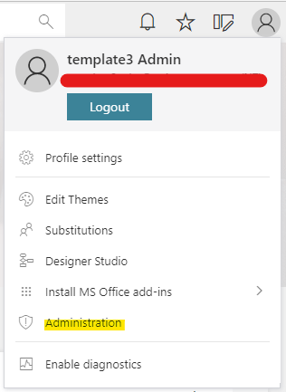
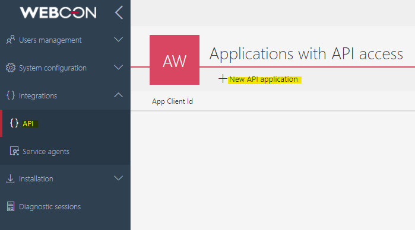
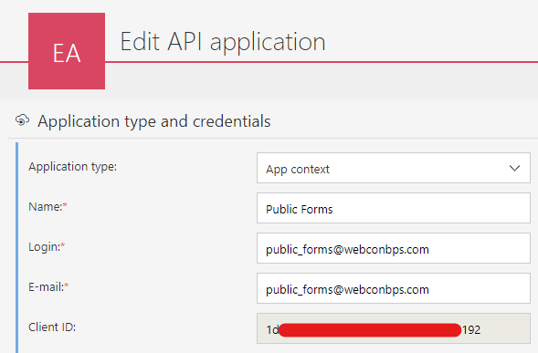
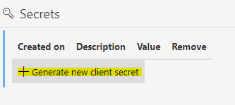
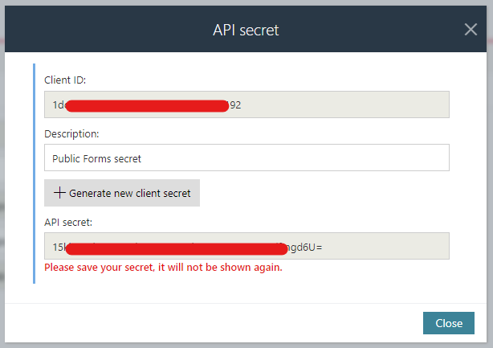
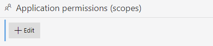
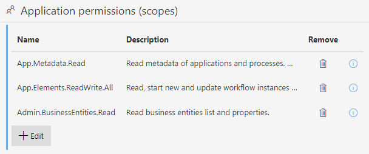
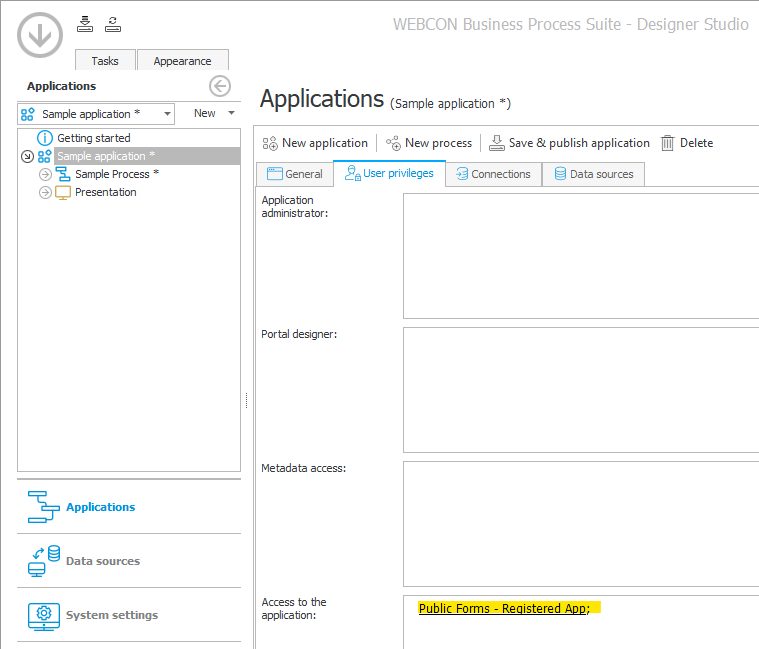
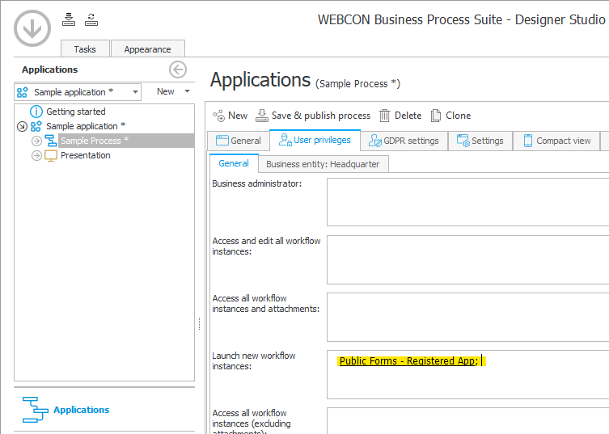
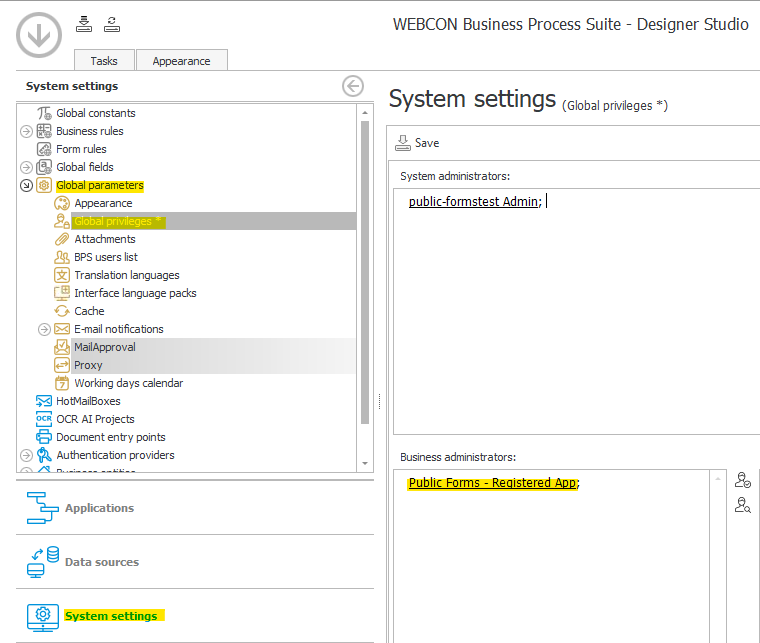

# public-forms

Please note that this is just a sample application, delivered under attached license.

The application integrates with your WEBCON BPS instance. Allows you to design public (anonymous) forms, eg. polls. 

## Supported fields and features
Public forms app `does not` support fields with `dynamic data sources`, `lists` and `attachments`.

# Installation 
The application can be hosted eg. on `IIS` (Internet Information Services), `Azure App Service`, or as a `Docker` container. 

# Configuration
To configure the application, some environment variables must be set:

Variable | Description | Example
--- | --- | ---
`APP_ADMIN_LOGIN` | Application's admin user. User that can create public forms | `admin`
`APP_ADMIN_PASSWORD` | Application's admin user password | `***`
`APP_BASE_DOMAIN` | Domain address that the application is hosted on | `publicforms.example.com`
`APP_BPS_PORTAL_URL` | Your WEBCON BPS Portal instance URL | `https://bps.example.com`
`APP_BPS_PORTAL_CLIENT_ID` | Your WEBCON BPS Portal `CLIENT_ID` for the integration | `***`
`APP_BPS_PORTAL_CLIENT_SECRET` | Your WEBCON BPS Portal `CLIENT_SECRET` for the integration | `***`
`APP_BPS_PORTAL_DB_ID` | WEBCON BPS content database Identifier | `1`
`APP_RECAPTCHA_API_KEY` | `Google reCAPTCHA` key to secure your public forms. Please visit https://developers.google.com/recaptcha/ for more information | 

## IIS 
https://docs.microsoft.com/en-us/iis/configuration/system.applicationhost/applicationpools/add/environmentvariables/

## Azure App Service
https://docs.microsoft.com/en-us/azure/app-service/configure-common#configure-app-settings

Windows Azure App Service

### App Service General Settings

Stack settings | Value
--- | ---
Stack | .NET
.NET version | .NET Core (3.1, 2.1)

## Docker (Linux)
```console
docker run -d \
    -e APP_ADMIN_LOGIN=admin \
    -e APP_ADMIN_PASSWORD=*** \
    -e APP_BASE_DOMAIN="publicforms.example.com" \
    -e APP_BPS_PORTAL_URL=https://bps.example.com \
    -e APP_BPS_PORTAL_CLIENT_ID="***" \
    -e APP_BPS_PORTAL_CLIENT_SECRET="***" \
    -e APP_BPS_PORTAL_DB_ID=1 \
    -p 8080:5000 \
    -v $(pwd)/public-forms-db:/app/db \
    --name public-forms \
    webconapps/public-forms
```

## Docker (Windows)
```console
docker run -d ^
    -e APP_ADMIN_LOGIN=admin ^
    -e APP_ADMIN_PASSWORD=*** ^
    -e APP_BASE_DOMAIN="publicforms.example.com" ^
    -e APP_BPS_PORTAL_URL=https://bps.example.com ^
    -e APP_BPS_PORTAL_CLIENT_ID="***" ^
    -e APP_BPS_PORTAL_CLIENT_SECRET="***" ^
    -e APP_BPS_PORTAL_DB_ID=1 ^
    -p 8080:5000 ^
    -v C:\public-forms-db:/app/db ^
    --name public-forms ^
    webconapps/public-forms
```

# WEBCON BPS Instance configuration
To make the integration work, you have to set up a new `API Integration application` and grant some permissions.

## 1. How to get BPS_PORTAL_CLIENT_ID/SECRET?
To generate `CLIENT_ID` and `CLIENT_SECRET`, please go to your `WEBCON BPS Portal` site, and then go to the `Administration`.



next, `Integrations` -> `API` and `New API application`.

.

### Basic information

The next step is to fill up some basic information:



Field | Description
--- | ---
`Application type` | Public forms app needs to have an `App context` because it's anonymous. No user information will be passed to the WEBCON BPS Instance. 
`Name` | Common name of the API application
`Login` | UPN of the user that all of the operations will be made of
`E-mail` | The user email address
`Client ID` | **This is your `APP_BPS_PORTAL_CLIENT_ID` environment variable value**

### Secret Key

Now, save the application, and generate `CLIENT_SECRET`:





And this is your `CLIENT_SECRET` environment variable value.

### Scopes - application permissions



To allow the `Public forms` app to interact with `WEBCON BPS`, some permissions have to be applied. 



For `reading` the BPS Applications/Processes configuration `App.Metadata.Read` scope is required.

For `starting new` workflow instances the `App.Elements.ReadWrite.All` scope is required.

For `listing` available `Business entities` the `Admin.BusinessEntities.Read` scope is required.

## 2. WEBCON BPS Permissions
Get the `login` you have set up in the previus step, and go to `WEBCON BPS Designer Studio`. 

### Application

Go to the `Application` you want to create public forms for, and enter the user's login in `Access to the application` section:



### Process

next, please go to the `Process`  you want to create public forms for, and enter the user's login in `Launch new workflow instances`.



### Global parameters

the last thing is to give the `API application's user` global `Business administrator` permissions. In order to do that, 
go to the `System settings`, `Global parameters`, `Global privileges`, and add the `login` to the `Business administrators` area.



**WEBCON BPS** configuration is ready.

# Logging
By default console logging is set. To change it, you have to modify `WEBCON.FormsGenerator.Presentation/nlog.config` file.

## Example of file logging

```xml
<?xml version="1.0" encoding="utf-8" ?>
<nlog xmlns="http://www.nlog-project.org/schemas/NLog.xsd" xmlns:xsi="http://www.w3.org/2001/XMLSchema-instance">
  <targets>
    <target name="log" xsi:type="File"
    fileName="${basedir}\Log\log${shortdate}.log"
    layout="${longdate} (${callsite:className}) - ${message} - ${exception:format=StackTrace}${newline}" />
  </targets>
  <rules>
    <logger name="*" minlevel="Trace" writeTo="log" />
  </rules>
</nlog>
```